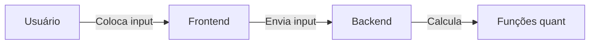

# turingfinance_backend

## Sumário
1. [Introdução](#introdução)
1. [Como executar a aplicação](#como-executar-a-aplicação)
1. [Fluxo de desenvolvimento](#fluxo-de-desenvolvimento)

<hr>

## Introdução

Este repositório contém um backend desenvolvido com Django-Rest-Framework para o cálculo de métricas financeiras, gestão de portfólio e disponibilização de visualizações de dados relacionados. O objetivo principal é fornecer uma API robusta e flexível para aplicativos ou sistemas que necessitam de funcionalidades financeiras e de análise de portfólio.

<hr>

## Como executar a aplicação

### Requisitos
* Python >= 3.8
* Pip

### Instalação e execução

1. Clone o repositório

1. Crie um ambiente virtual: 
```bash
pip install virtualenv
virtualenv venv
```

2. Ative o ambiente virtual:
```bash
source venv/bin/activate
```

3. Instale as dependências:
```bash
pip install -r requirements.txt
```

4. Localize o arquivo `manage.py` e aplique as migrações:
```bash
python3 manage.py makemigrations && python3 manage.py migrate
```

5. Rode o servidor
```bash
python3 manage.py runserver
```

## Estrutura do Projeto

```
.
├── manage.py
├── tfinance_backend/
└── tquant_api/
```

1. **manage.py**: Arquivo principal do projeto, utilizado para rodar comandos Django.
2. **tfinance_backend/** : Pasta principal do projeto, onde ficam as configurações relacionadas ao backend como um todo.
3. **tquant_api/**: Pasta de uma aplicação Django chamada tquant_api onde estão definidas a lógica e a regra de negócio relacionadas ao cálculo das visualizações e métricas financeiras.

<hr>

## Fluxo de Desenvolvimento

O projeto foi concebido de forma a separar o máximo possível a regra de negócio principal, que é a da área Quant, das demais preocupações relacionadas ao Backend em si, como a criação de endpoints e o tratamento das requisições, bem como as validações dos inputs. 

Dessa forma, a lógica e as validações específicas da área Quant foram isoladas, permitindo que sejam tratadas de maneira independente e garantindo um bom _separation of concerns_.

### Fluxo do Desenvolvimento
1. Definição das funções de cálculo de métricas no arquivo [metrics.py](https://github.com/rodrigomarcolin/turingfinance_backend/blob/main/tfinance_backend/tquant_api/metrics.py) e de plotagem de gráficos no arquivo [plots.py](https://github.com/rodrigomarcolin/turingfinance_backend/blob/main/tfinance_backend/tquant_api/plots.py)
2. Definição/adaptação de endpoint no Backend que recebe inputs adequados, valida e chama a função de Quant correspondente
3. Adaptação do FrontEnd para incluir suporte ao novo/modificado endpoint

Dessa maneira, colaboradores que queiram restringir-se somente ao escopo Quant podem dedicar-se à etapa 1. Colaboradores que desejem contribuir com o aspecto Web do sistema podem então realizar as etapas 2 e 3.

### Comportamento final do sistema


